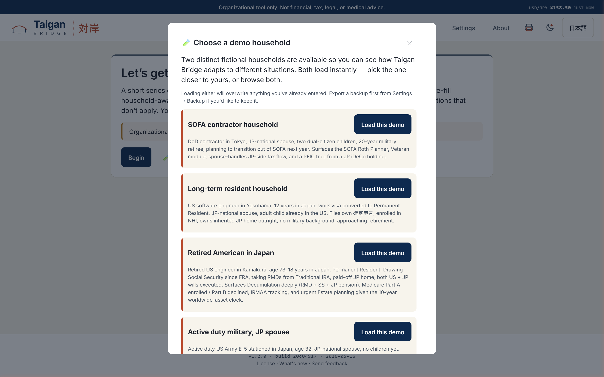
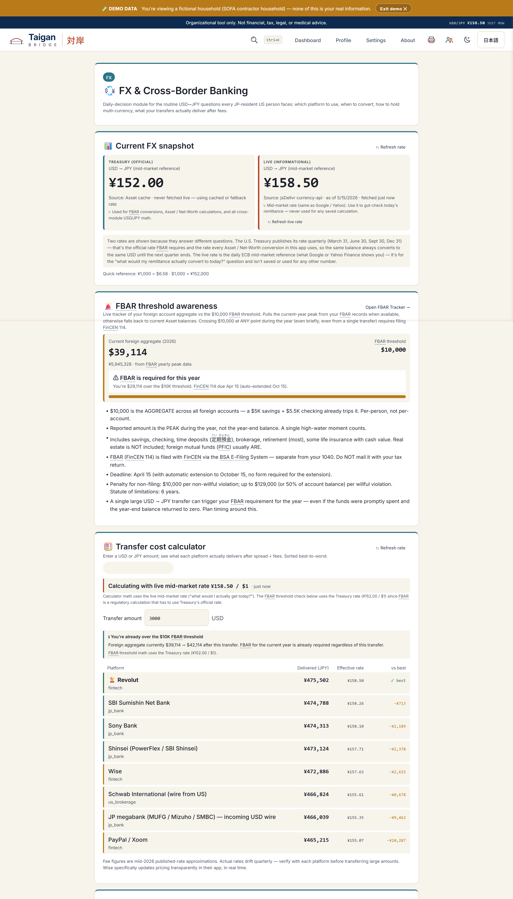
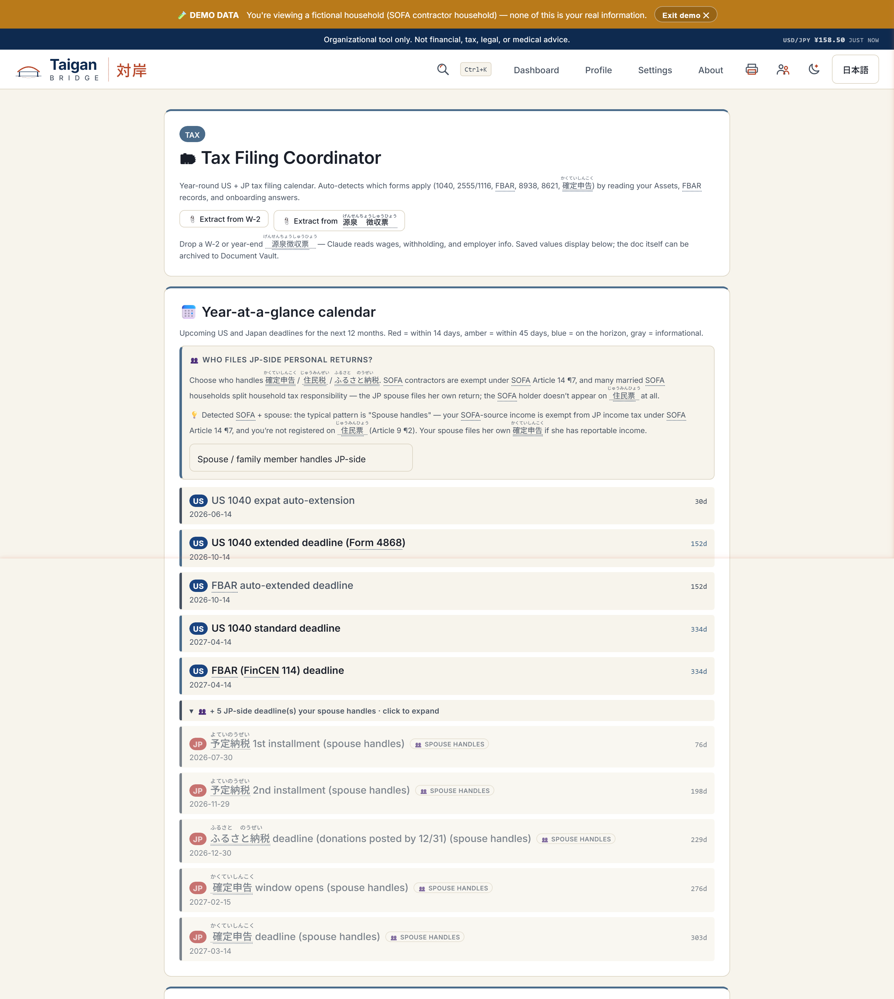
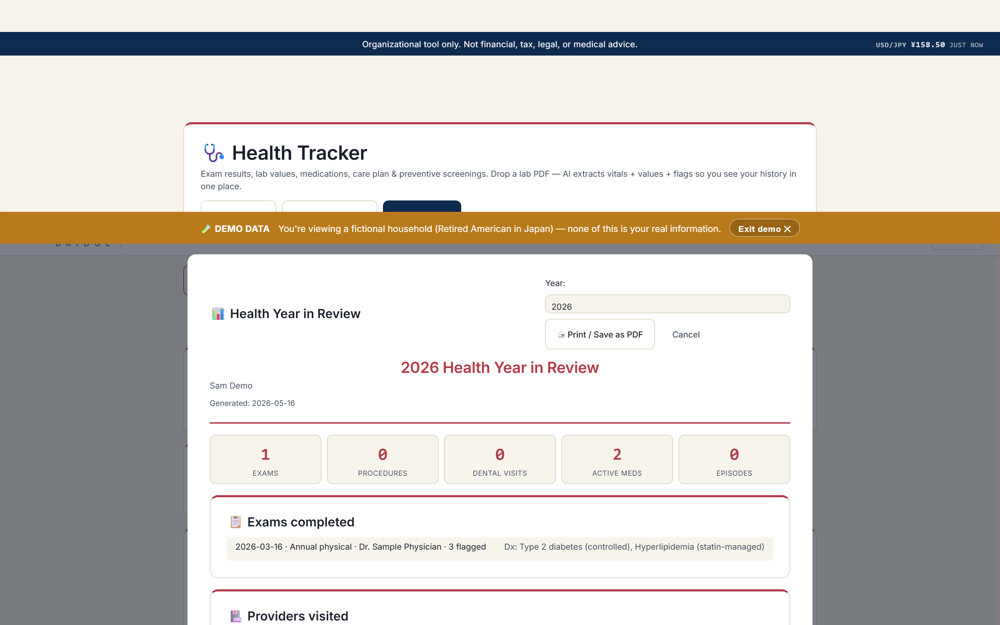
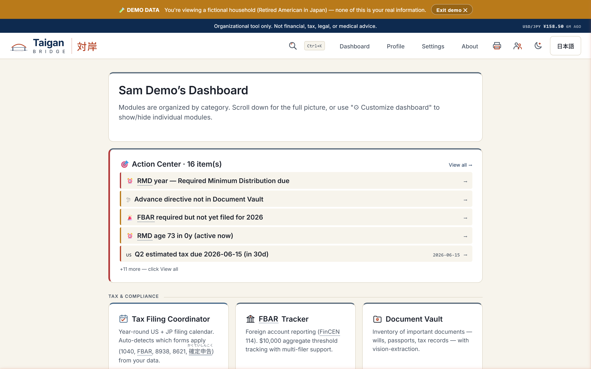
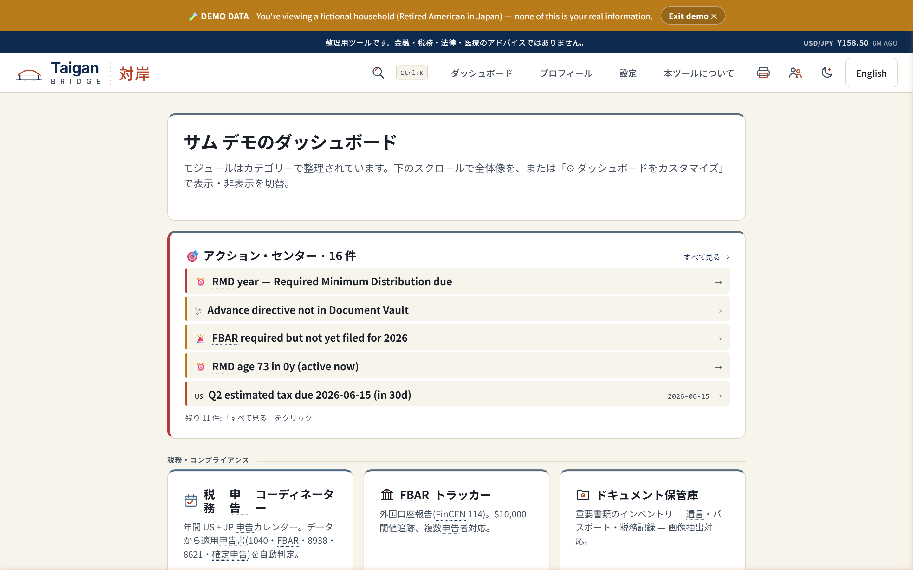

# Taigan Bridge 対岸

**Financial, tax, estate, and health planning for Americans on the
opposite shore.**

[](https://github.com/beichhorn-taigan/taigan-bridge/releases)
[](LICENSE.md)
[](#)
[](#)

Taigan Bridge is a single-file HTML organizer for U.S. persons living
in Japan — SOFA-status contractors, U.S. military veterans, long-term
expats on work / spouse visas, mixed-citizenship families, and the
American side of dual-citizen households. Everything runs in your
browser. No backend. No signup. No telemetry. No accounts. Your data
stays on your machine.

**Download one HTML file, double-click to open, start organizing.**

---

## Download & install

### Easiest path — Releases

1. Go to the **[Releases page](https://github.com/beichhorn-taigan/taigan-bridge/releases/latest)**
2. Under **Assets**, download `taigan-bridge-vX.Y.Z.html` (~4 MB)
3. Double-click the file. It opens in your default browser. That's
   the entire installation — no setup, no signup.
4. Bookmark the local file so you can come back to it. In Chrome /
   Edge / Firefox the URL will look like `file:///C:/…` or
   `file:///Users/…`.

### Try-instantly path — Hosted demo (look, don't live in it)

If you'd rather poke around before downloading, the latest build is
hosted as a static page at
**[beichhorn-taigan.github.io/taigan-bridge](https://beichhorn-taigan.github.io/taigan-bridge)**
(when GitHub Pages is live for the current release).

**The hosted version is a guided tour, not a workspace.** When you
open it you'll land inside a pre-loaded sample household (the SOFA
profile) and a red "LIVE DEMO" banner sits across the top of every
page. The demo exists so you can click through the modules — net
worth, FBAR, retirement, tax — and decide whether the app is worth
the two-minute download. It is **not** a place to enter your real
financial information:

- Any onboarding info you type gets overwritten the next time you
  refresh, because the page re-seeds the sample profile.
- You're sharing localStorage with whatever the browser remembers
  from `github.io` — not a great neighborhood for account numbers,
  balances, or `マイナンバー`.
- I (the author) don't run a backend, but I also can't promise the
  hosted build stays at any particular version, or that I won't
  redeploy it tomorrow and wipe your draft.

When you're ready to actually use the tool, follow the **Stable
path** above to download `taigan-bridge.html` and open it from your
own disk. Same code, but it's yours — the browser treats `file://`
as a separate origin, your data never sees the hosted version, and
nothing gets overwritten on you.

### Developer path — Clone and build

```bash
git clone https://github.com/beichhorn-taigan/taigan-bridge.git
cd taigan-bridge
npm install
npm run dev          # serves src/ on http://localhost:4747
npm run build        # produces dist/taigan-bridge.html (single file)
```

The development tree under `src/` is split across `styles/`,
`scripts/`, `content/`, and `assets/` for ergonomic editing. The
`build.js` step inlines everything — JS, CSS, SVG, License text,
Changelog, About copy — into a single self-contained
`dist/taigan-bridge.html` ready for distribution.

See [docs/BUILD.md](docs/BUILD.md) for build details and
[docs/ARCHITECTURE.md](docs/ARCHITECTURE.md) for the module
branching architecture.

---

## Try it without entering anything

The fastest way to see what Taigan Bridge does is to load the sample
household. From the welcome screen: **🧪 Try with sample data** —
one click loads one of four realistic fictional households so you
can explore every module without committing to your own numbers.

| Profile | Audience |
|---|---|
| **SOFA contractor household** | DoD contractor in Tokyo, JP spouse, dual-citizen kids, 20-year military retiree, transitioning out of SOFA |
| **Long-term resident household** | U.S. software engineer in Yokohama, work visa → Permanent Resident, JP spouse, adult child already in the U.S. |
| **Retired American in Japan** | Retired in Kamakura, age 73, drawing SS + taking RMDs, both U.S. + JP wills executed, urgent 10-year-clock estate planning |
| **Active duty military, JP spouse** | Army E-5 stationed in Japan, age 32, no kids yet, SOFA active, modest early-career assets |

A sticky **🧪 DEMO DATA** banner makes sure you never confuse the
fictional records with your own. **Exit demo + wipe** in Settings
wipes back to a clean slate.

---

## What's in it

Sixteen modules, all bilingual EN / JP, all driven by a short
branching onboarding so the dashboard surfaces only what applies to
your situation:

- **Net Worth + Assets** — multi-currency accounts, year-end
  snapshots, beneficiary review, PFIC scan, tax-loss harvesting (Q4).
- **FBAR (FinCEN 114)** — full year-by-year filing tracker with
  Treasury rates, multi-filer households, vision import for
  passbooks / statements, the Form 114a generator, late-filing
  explanation drafter, and an FBAR Advisor Q&A.
- **Tax Coordinator** — bilingual deadline calendar, forms
  applicability (1040 / 2555 / 1116 / 8938 / 8621 / 確定申告),
  document checklist, JP-side filing-responsibility split for
  SOFA + JP-spouse households, FEIE-vs-FTC decision support,
  PFIC alerts, CPA briefing markdown. Vision import for W-2 +
  源泉徴収票.
- **Projections** — long-horizon scenarios with NIIT, IRMAA,
  state tax, Roth conversion ladder, scenario compare.
- **Decumulation** — Social Security claiming strategy with
  WEP/GPO repeal handling, JP pension vesting (国民年金 / 厚生年金 /
  追納 / 任意加入 / 合算 / カラ期間), RMD timing. Vision import
  for 年金定期便 + SSA statement.
- **SOFA Roth Sequencing Planner** — for the high-stakes window
  between SOFA status and 住民票 registration.
- **Estate** — JP statutory shares (民法 §887–§890) from your
  family roster, 相続税 estimation with 小規模宅地等の特例,
  will tracker, 戸籍 handling for foreign decedents, Letter of
  Instruction generator, §877A exit-tax / renunciation section.
- **Property** — JP + U.S. real estate with 固定資産税, §121 /
  §469 / §1250 cross-border treatment, rental income with FEIE /
  FTC routing, 古民家 / 農地 inheritance scenarios. Vision import
  for 固定資産税通知書.
- **Family** — passport renewal with vision import (handles
  令和 → ISO), 国籍選択 deadlines for dual-citizen children,
  education savings (529 vs 教育資金一括贈与), gift pre-positioning
  (暦年贈与 / 教育資金一括贈与 / 結婚・子育て / 相続時精算課税).
- **Veteran** — VA benefits, FMP, TRICARE Overseas, Post-9/11 GI
  Bill, SBP / DIC, VGLI deadline. Status-aware.
- **Healthcare** — Medicare Part B / IRMAA, FEHB / TRICARE / FMP
  routing, NHI / SHI estimation, 介護保険 timing.
- **Health Tracker** — exam history, lab results with bilingual
  reference ranges + AI-generated explanations, dental periodontal
  tracking with per-tooth findings, medication list, insurance
  card capture, invoice import, care episodes, printable
  Year-in-Review.
- **Document Vault** — inventory of where every important
  document lives, AI-classified, expiry alerts, bulk import.
- **Contacts** — unified address book that auto-pulls from every
  other module + built-in Japan emergency numbers.
- **Consultations** — track CPAs / 税理士 / lawyers, per-meeting
  log + follow-up reminders.
- **FX & Cross-Border Banking** — live mid-market USD/JPY +
  Treasury rate, bidirectional transfer-cost calculator across
  Wise / Revolut / SBI Sumishin / Sony Bank / Schwab International
  / etc., with FBAR threshold callouts.
- **Action Center** — the "what should I do today?" surface
  aggregating time-sensitive items from every module.
- **Sharing + Backup** — Spouse Handoff HTML (bilingual when a JP
  spouse is detected), Survivor Guide (formatted for printing and
  storing with the will), Advisor JSON, full-state backup with
  optional auto-prompt schedule.
- **Ask Taigan** — opt-in AI assistant with read-only access to
  your Taigan Bridge state.

---

## Privacy

- **Local-only.** Every record lives in your browser's
  `localStorage`. The downloaded app has no analytics, no telemetry, no
  tracking pixels, and no fonts loaded from a CDN — search the file and
  there is nothing to find.
- **Hosted demo is the one exception.** The public preview at
  `beichhorn-taigan.github.io` loads GoatCounter — a privacy-friendly,
  cookieless analytics service — to count aggregate page views. It sets
  no cookies, collects no personal data, and does no cross-site
  tracking; any ad-blocker blocks it entirely. The snippet is injected
  only into the hosted copy at deploy time and is **never** present in
  the file you download.
- **Zero outbound traffic at boot.** No "phone home" on startup.
- **Optional outbound calls** happen only on explicit user action:
  the live USD/JPY rate fetch (no PII), the Treasury quarterly
  rate fetch (no PII), and Claude API calls — using your key,
  your prompts, going directly from your browser to Anthropic.
- **No account.** No login. No email collection. No "sign up to
  continue." Open the file, start using it.

---

## What this is not

Not financial advice. Not tax advice. Not legal advice. Not
medical advice. Not a substitute for a CPA, tax attorney, estate
attorney, licensed financial advisor, Japanese 税理士, or your
physician.

Cross-border tax and estate planning is genuinely difficult.
Japanese inheritance tax is among the world's most aggressive.
PFIC rules make most Japanese investment vehicles toxic for U.S.
persons. The 10-year clock changes the global-asset tax base.
The Health Tracker organizes what your doctor told you — it does
not interpret labs, recommend treatment, or substitute for
clinical judgment. The most expensive mistakes — financial and
medical — are the ones made without a qualified professional in
the loop.

Use this tool to organize your thinking, surface the right
questions, and prepare a complete picture to bring to qualified
professionals — then act on their guidance.

---

## Screenshots

> Screenshots from the four demo profiles. Reload the latest
> release if any are out of date.

| | |
|---|---|
|  |  |
| **Welcome → 🧪 Try with sample data** | **FX calculator — live + Treasury rates side-by-side, bidirectional USD↔JPY** |
|  |  |
| **Tax Coordinator — bilingual deadline calendar with collapsible spouse-handles section** | **Year-in-Review — printable yearly health summary** |
|  |  |
| **Dashboard — English** | **Dashboard — 日本語(同じ画面、ワンクリックで切替)** |

---

## Contributing

Taigan Bridge is **not open for code contributions**. The license
prohibits derivative works for redistribution; pull requests with
new features or modifications won't be merged.

What's genuinely useful and welcome:

- **Bug reports.** Open an issue with steps to reproduce, the
  build version (shown in the footer + the About page), and your
  browser. Include the `console.log` output if applicable.
- **JP translation suggestions.** If you read Japanese natively
  and spot phrasing that reads like a translation rather than
  natural Japanese, open an issue and quote the exact string.
- **Feature requests.** Open an issue describing the situation
  you wish the tool covered. Not every request will be built,
  but every one is read.
- **In-app feedback.** Use the **Send feedback** link in the
  footer for anything you'd rather not file publicly.

---

## Support development

Taigan Bridge is free and ad-free. Tips fund the Claude API costs
that keep the AI-assisted features working and pay for the
occasional professional review of cross-border tax and medical
content.

- [💖 GitHub Sponsors](https://github.com/sponsors/beichhorn-taigan) — monthly or one-time, best fit if you already have a GitHub account
- [☕ Ko-fi](https://ko-fi.com/taiganbridge) — one-time tip, no signup
- [🥐 Buy Me a Coffee](https://www.buymeacoffee.com/TaiganBridge)

All three reach the same person — pick whichever flow you prefer.

---

## License

Free for personal, non-commercial use, distributed exclusively
through the official channels listed in
[LICENSE.md](LICENSE.md) — this GitHub repository, releases, and
(when launched) taiganbridge.com. Redistribution, mirroring, or
re-publication on third-party platforms requires written
permission.

See [LICENSE.md](LICENSE.md) for full terms.

---

## Contact

Bug reports, feature requests, JP translation suggestions:
[open an issue](https://github.com/beichhorn-taigan/taigan-bridge/issues/new).
For licensing inquiries, partnership requests, or commercial use:
benjamin.eichhorn@gmail.com.
